**Setting Up the Stochastic Data Import Tool**

## Tasks: 

1.  To begin setting up the SDI open or create a new WAT project.

2.  From the Study Tab, if the Models Tree Node is not expanded, expand
    it. Select the **Stochastic Hydrologic Data Importer**, right click
    and select **New…** as shown in Figure 1.

<table>
<thead>
<tr class="header">
<th>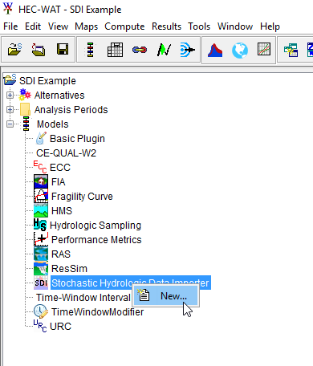</th>
</tr>
</thead>
<tbody>
<tr class="odd">
<td><em><strong>Figure 1. Create New Stochastic Hydrologic Data Importer</strong></em></td>
</tr>
</tbody>
</table>

  - This will elicit the **Create New SDI Alternative** Editor as shown
    in Figure 2. Define a name for the alternative and select **OK**.

<table>
<thead>
<tr class="header">
<th>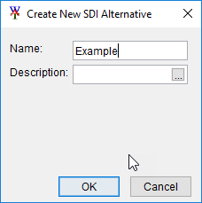</th>
</tr>
</thead>
<tbody>
<tr class="odd">
<td><em><strong>Figure 2. Create New SDI Alternative Editor</strong></em></td>
</tr>
</tbody>
</table>

  - Then the **Stochastic Data Import** Editor will show up as shown in
    Figure 3.

<table>
<thead>
<tr class="header">
<th></th>
</tr>
</thead>
<tbody>
<tr class="odd">
<td><em><strong>Figure 3. Stochastic Data Importer Editor</strong></em></td>
</tr>
</tbody>
</table>

> For the Trinity River project the input DSS data for the SDI is
> organized as one event per year, with the start of year being the
> Calendar year. Change the Radio selection for the Start of Year group
> box to **Calendar Year (01Jan).**
> 
> The following elements **Event/Year Count, for Data Check and DSS File
> setup** are only to assist the user in determining if their data meets
> the required data validation. It is not used by the HEC-WAT FRA
> simulation, in fact, it is replaced by the simulation settings.
> 
> For our example study we are expecting 1 realization with 500 years of
> data, with 50 years in each lifecycle. After filling out the “Events”
> tab, the Stochastic Data Import Editor should look like Figure 3.

  - Next move to the **Locations and Parameters** tab. In this tab we
    will define all of the locations that are needed to produce data for
    models below the SDI in the program order. In our case HMS and
    ResSim are below the SDI, and they will be consuming boundary
    conditions provided by the SDI. A single location will be made for
    each boundary condition. If temperature and precipitation are needed
    at the same location, one input location will need to be created,
    and both parameters will need to be checked.

> These locations can be named whatever the user wants, but using the
> naming convention of the consuming model (HMS or ResSim) can simplify
> the model linking stage later in the workflow.
> 
> Below the **Creation of Data locations** panel, select the **New**
> button, and use Figure 4 for the location name. For every row that has
> an x in the Precip column check the precip box, for every row that has
> an x in the temp column check the temp box.

<table>
<thead>
<tr class="header">
<th><table>
<thead>
<tr class="header">
<th>ID</th>
<th>Precip</th>
<th>Temp</th>
</tr>
</thead>
<tbody>
<tr class="odd">
<td>USC00410313</td>
<td>X</td>
<td></td>
</tr>
<tr class="even">
<td>USC00413668</td>
<td>X</td>
<td></td>
</tr>
<tr class="odd">
<td>USC00410271</td>
<td>X</td>
<td></td>
</tr>
<tr class="even">
<td>USC00414517</td>
<td>X</td>
<td></td>
</tr>
<tr class="odd">
<td>USC00410984</td>
<td>X</td>
<td></td>
</tr>
<tr class="even">
<td>USC00414972</td>
<td>X</td>
<td></td>
</tr>
<tr class="odd">
<td>USC00419532</td>
<td>X</td>
<td></td>
</tr>
<tr class="even">
<td>USC00411063</td>
<td>X</td>
<td></td>
</tr>
<tr class="odd">
<td>USC00412334</td>
<td>X</td>
<td></td>
</tr>
<tr class="even">
<td>USC00413247</td>
<td>X</td>
<td></td>
</tr>
<tr class="odd">
<td>USC00411800</td>
<td>X</td>
<td></td>
</tr>
<tr class="even">
<td>USC00416130</td>
<td>X</td>
<td></td>
</tr>
<tr class="odd">
<td>USC00417659</td>
<td>X</td>
<td></td>
</tr>
<tr class="even">
<td>USC00345563</td>
<td>X</td>
<td></td>
</tr>
<tr class="odd">
<td>USC00412404</td>
<td>X</td>
<td></td>
</tr>
<tr class="even">
<td>USC00410337</td>
<td>X</td>
<td></td>
</tr>
<tr class="odd">
<td>USC00413691</td>
<td>X</td>
<td></td>
</tr>
<tr class="even">
<td>USC00417028</td>
<td>X</td>
<td></td>
</tr>
<tr class="odd">
<td>USC00411490</td>
<td>X</td>
<td></td>
</tr>
<tr class="even">
<td>USW00013960</td>
<td>X</td>
<td></td>
</tr>
<tr class="odd">
<td>USC00419522</td>
<td>X</td>
<td></td>
</tr>
<tr class="even">
<td>USC00418274</td>
<td>X</td>
<td></td>
</tr>
<tr class="odd">
<td>USC00415766</td>
<td>X</td>
<td></td>
</tr>
<tr class="even">
<td>USC00410262</td>
<td>X</td>
<td></td>
</tr>
<tr class="odd">
<td>Temperature</td>
<td></td>
<td>X</td>
</tr>
</tbody>
</table></th>
</tr>
</thead>
<tbody>
<tr class="odd">
<td><em><strong>Figure 4. Location Names</strong></em></td>
</tr>
</tbody>
</table>

> Before leaving the tab, change the primary location combo box to refer
> to USC00410313 – Precip as shown in Figure 5. This location is
> utilized in the SDI validation routines, and is a required input.

<table>
<thead>
<tr class="header">
<th>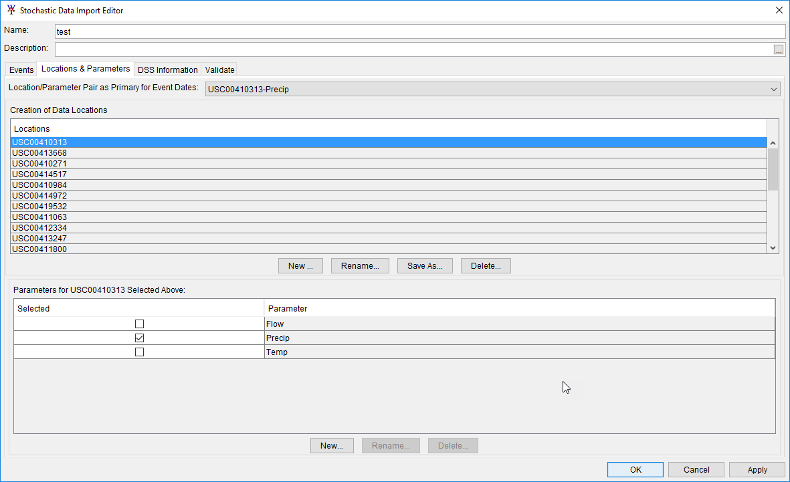</th>
</tr>
</thead>
<tbody>
<tr class="odd">
<td><em><strong>Figure 5. USC00410313-Precip Location</strong></em></td>
</tr>
</tbody>
</table>

  - On the **DSS Information** tab you will see rows for each location
    and parameter created on the Locations & Parameters tab that need
    DSS paths defined.

> It is best practice to move the DSS dataset into the shared directory
> of the WAT project so that the data will always be stored with the WAT
> project in case the project is shared from one computer to another.
> Check the shared directory and make sure that the “test.dss” file is
> there, if not copy the file to the shared directory.
> 
> Select the first row and then press the **Select DSS Path** button in
> the lower right hand corner. Browse to the project’s shared data
> folder and select “test.dss” file. Use the dss path that has a b part
> titled by the name of the location, the correct parameter in the c
> part, and “C:000001|swg” in the F part. The result should look like
> Figure 6.

<table>
<thead>
<tr class="header">
<th>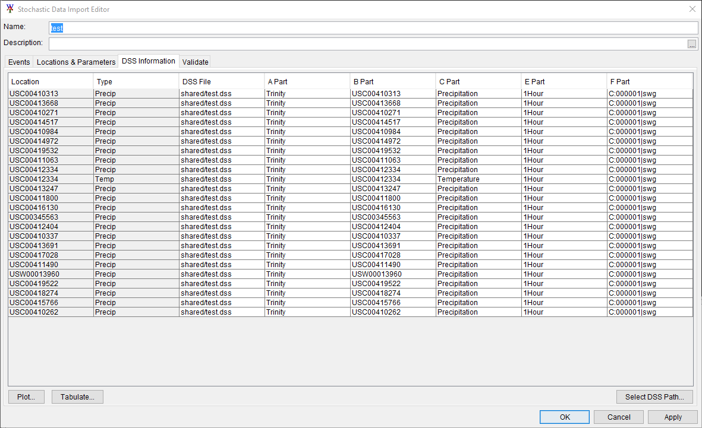</th>
</tr>
</thead>
<tbody>
<tr class="odd">
<td><em><strong>Figure 6. DSS Information tab</strong></em></td>
</tr>
</tbody>
</table>

> Then select the **Validate** tab and press **Validate DSS
> Information** – it should look something like Figure 7.

<table>
<thead>
<tr class="header">
<th>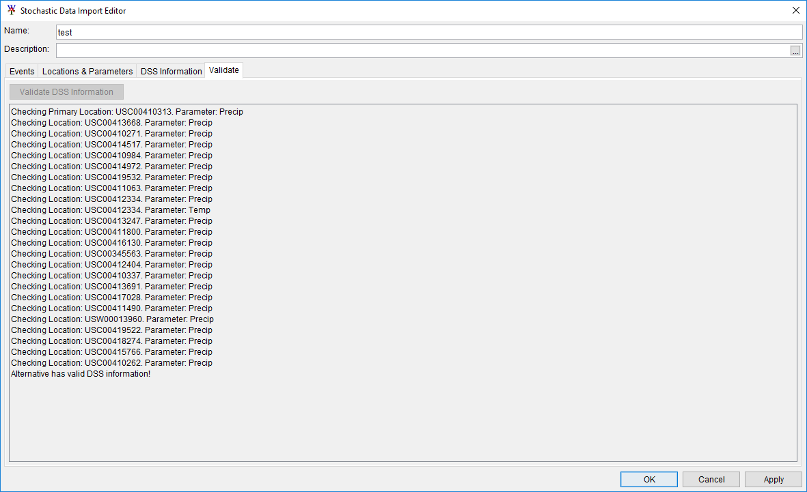</th>
</tr>
</thead>
<tbody>
<tr class="odd">
<td><em><strong>Figure 7. Validate tab</strong></em></td>
</tr>
</tbody>
</table>

> The SDI will copy data from the DSS File stored in the shared
> directory to the appropriate lifecycle DSS file during a WAT FRA
> compute. The data copied will be dependent on the date range of the
> Analysis Period. To ensure your data is retrieved properly, it is best
> to make the Analysis Period in the WAT match the DSS data utilized by
> the SDI.
> 
> From the SDI when you select a location you can choose the
> **Tabulate** button at the lower left hand corner of the window. The
> first date in the tabulation should correspond to the start of the
> Analysis Period, and the last date in the tabulation should correspond
> to the end of the analysis period. In our case, since we are finding
> events based on the start of the calendar year, our start date can be
> between 01JAN2000 0000 and 01MAR2000 0000. For Trinity, all events
> start on March 1st, this allows us to be flexible in our
> start date in our Analysis Period. Our end date can go all the way to
> 31DEC2049 2400.

3.  To create a new analysis period right click on the **Analysis
    Period** Tree node and select **New…** as shown in Figure 8.

<table>
<thead>
<tr class="header">
<th>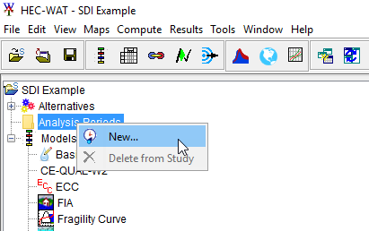</th>
</tr>
</thead>
<tbody>
<tr class="odd">
<td><em><strong>Figure 8. Create an Analysis Period</strong></em></td>
</tr>
</tbody>
</table>

  - Provide a name and use the start and end dates from the dss inputs
    into SDI… as shown in Figure 9.

<table>
<thead>
<tr class="header">
<th>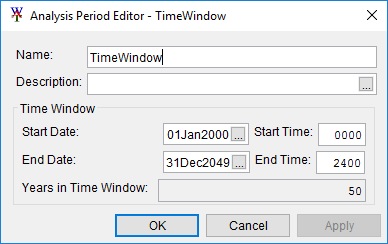</th>
</tr>
</thead>
<tbody>
<tr class="odd">
<td><em><strong>Figure 9. Analysis Period Editor - TimeWindow</strong></em></td>
</tr>
</tbody>
</table>

4.  The next step in the process is to create an alternative using the
    Trinity Plugin. This plugin has been developed to compute cumulative
    precip and also the max of the average over the critical duration
    for each location. All you need to do for this plugin to know about
    the output locations is to create the alternative. The output
    locations are hard coded for this plugin.

<!-- end list -->

  - To do so Right click on the **Trinity Plugin** and select **New…**
    as shown in Figure 10. Give the alternative the name of “test” and
    press **OK**.

<table>
<thead>
<tr class="header">
<th>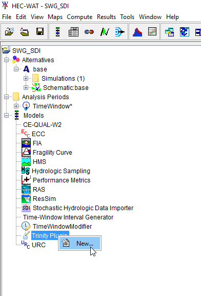</th>
</tr>
</thead>
<tbody>
<tr class="odd">
<td><em><strong>Figure 10. Create New Trinity Plugin</strong></em></td>
</tr>
</tbody>
</table>

5.  Now that both plugins that will be utilized in this simulation have
    defined alternatives, and we have created an analysis period, we can
    create a simulation. The first step in creating a simulation is to
    create an alternative. Go up to the **Alternative**, right click and
    select **New…** as shown in Figure 11.

<table>
<thead>
<tr class="header">
<th>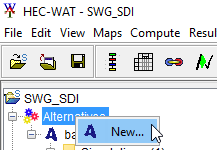</th>
</tr>
</thead>
<tbody>
<tr class="odd">
<td><em><strong>Figure 11. Create New Alternative</strong></em></td>
</tr>
</tbody>
</table>

**Create New Alternatives** Editor will show up as shown in Figure 12.

<table>
<thead>
<tr class="header">
<th>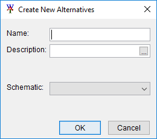</th>
</tr>
</thead>
<tbody>
<tr class="odd">
<td><em><strong>Figure 12. Create New Alternatives Editor</strong></em></td>
</tr>
</tbody>
</table>

> Give the alternative the name of “test”. Since no schematic has been
> created, WAT will ask you to create a schematic, select **Yes** and
> then press **Ok**.

6.  After the alternative has been created create a simulation. In the
    study pane right click on the **simulations** as shown in Figure 13.

<table>
<thead>
<tr class="header">
<th>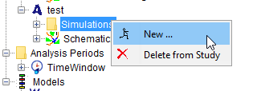</th>
</tr>
</thead>
<tbody>
<tr class="odd">
<td><em><strong>Figure 13. Create New Simulation</strong></em></td>
</tr>
</tbody>
</table>

**Create New Simulation** Editor will show up as shown in Figure 14.

<table>
<thead>
<tr class="header">
<th>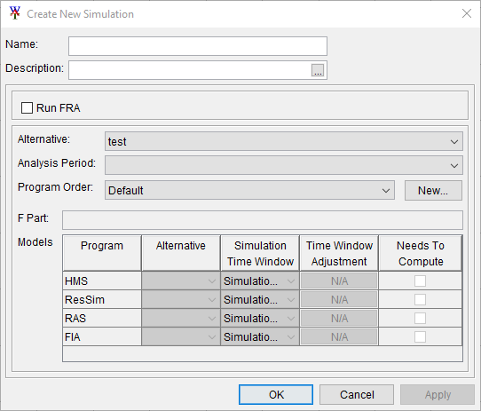</th>
</tr>
</thead>
<tbody>
<tr class="odd">
<td><em><strong>Figure 14. Create New Simulation Editor</strong></em></td>
</tr>
</tbody>
</table>

  - Give the simulation the name “Trinity Testing”. Check the box **Run
    FRA**. Set the number of realizations to 1. Select the **Example**
    as the Hydrologic Event Alternative. Select **test** as the
    Alternative. Select your analysis period.

  - To the right of the combo box named **Program order** there is a
    button named **New..**. Press that button. **New Program Order**
    editor will show up. Create a new Program order titled “TP”. Select
    the **Select Programs** button. The **Selection Editor** window will
    show up. Select the **Trinity Plugin** and press **OK**. The editor
    should look like Figure 15 now.

<table>
<thead>
<tr class="header">
<th>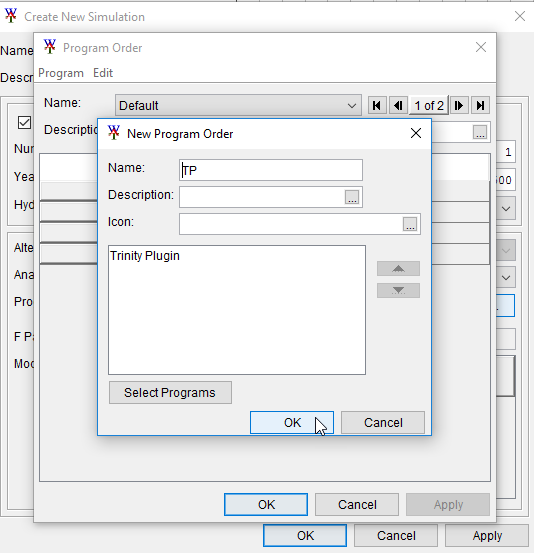</th>
</tr>
</thead>
<tbody>
<tr class="odd">
<td><em><strong>Figure 15. Create New Program Order</strong></em></td>
</tr>
</tbody>
</table>

  - Select the **TP** program order and then in the data table below
    select the “test” alternative, then press **OK**. The **Create New
    Simulation** editor should look like Figure 16.

<table>
<thead>
<tr class="header">
<th>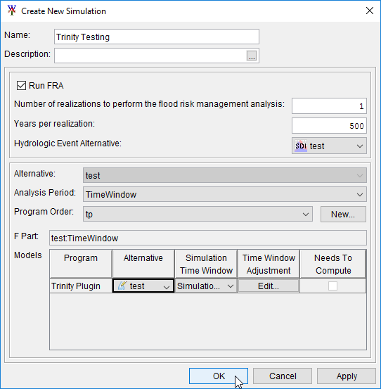</th>
</tr>
</thead>
<tbody>
<tr class="odd">
<td><em><strong>Figure 16. trinity Testing Simulation Editor</strong></em></td>
</tr>
</tbody>
</table>

7.  Now that the simulation has been created we need to link the trinity
    plugin to the SDI output. To do that right click on the “Trinity
    Testing” simulation, and select **Model Linking Editor** as shown in
    Figure 17.

<table>
<thead>
<tr class="header">
<th>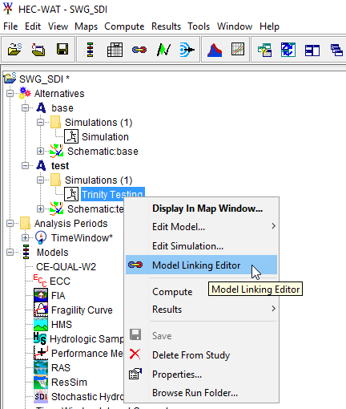</th>
</tr>
</thead>
<tbody>
<tr class="odd">
<td><em><strong>Figure 17. Set Up the Model Linking Editor</strong></em></td>
</tr>
</tbody>
</table>

  - In the model linking editor select the “Trinity Plugin – test” as
    the **Model To Link** and your locations should appear as shown in
    Figure 18.

<table>
<thead>
<tr class="header">
<th>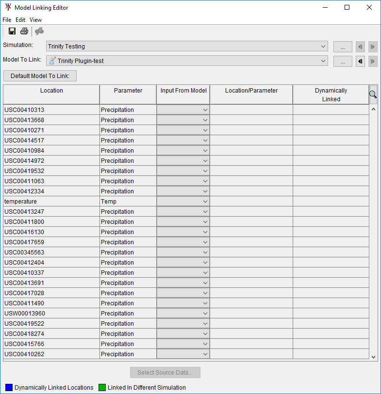</th>
</tr>
</thead>
<tbody>
<tr class="odd">
<td><em><strong>Figure 18. Model Linking Editor</strong></em></td>
</tr>
</tbody>
</table>

  - To link them to the SDI press the button **Default Model To Link**
    and select **Stochastic Hydraulic Data Importer – Example.** Press
    **OK**, and then agree to the warning message. All of the links
    should show up as shown in Figure 19.

<table>
<thead>
<tr class="header">
<th>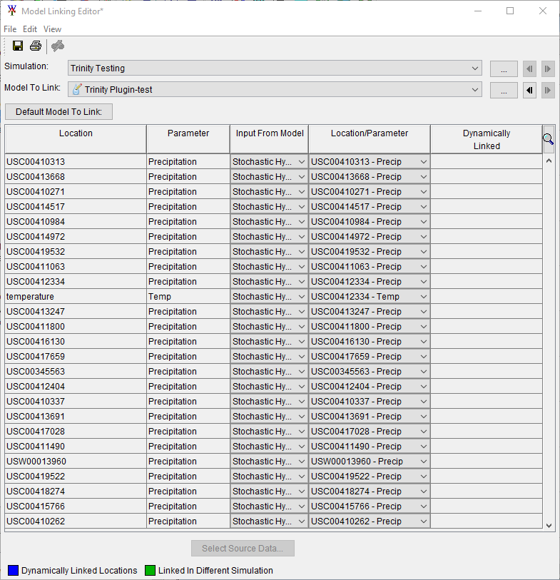</th>
</tr>
</thead>
<tbody>
<tr class="odd">
<td><em><strong>Figure 19. Model Linking Editor with links</strong></em></td>
</tr>
</tbody>
</table>

8.  Now click on the output variable Editor as shown in Figure 20.

<table>
<thead>
<tr class="header">
<th>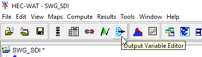</th>
</tr>
</thead>
<tbody>
<tr class="odd">
<td><em><strong>Figure 20. Set Up the Output Variable Editor</strong></em></td>
</tr>
</tbody>
</table>

  - Select the “Trinity Testing” simulation, the “Trinity Plugin”
    plugin, and the “test” Alternative and then click the **Select
    Variables to Save…** button as shown in Figure 21.

<table>
<thead>
<tr class="header">
<th></th>
</tr>
</thead>
<tbody>
<tr class="odd">
<td><em><strong>Figure 21. Output Variable Editor</strong></em></td>
</tr>
</tbody>
</table>

  - Add All locations, and press **OK** as shown in Figure 22.

<table>
<thead>
<tr class="header">
<th>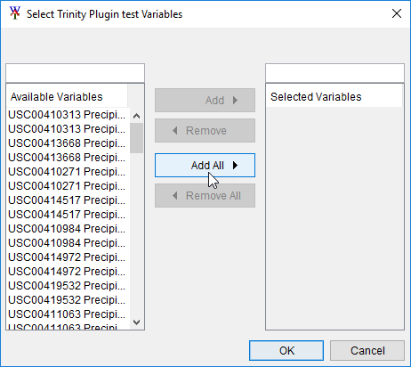</th>
</tr>
</thead>
<tbody>
<tr class="odd">
<td><em><strong>Figure 22. Select Trinity Plugin test Variables</strong></em></td>
</tr>
</tbody>
</table>

> All locations will appear twice as shown in Figure 23 (except the
> temperature record, which will appear once), turn on the frequency
> option for all locations by checking the checkbox in the frequency
> column.

<table>
<thead>
<tr class="header">
<th>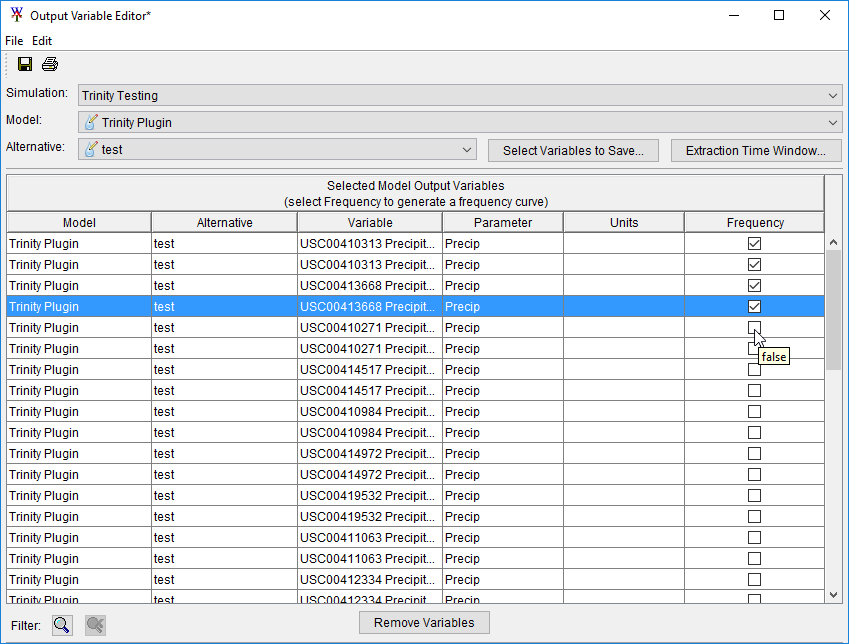</th>
</tr>
</thead>
<tbody>
<tr class="odd">
<td><em><strong>Figure 23. Output Variable Editor</strong></em></td>
</tr>
</tbody>
</table>

9.  Now we are ready to run the simulation. Right click on “Trinity
    Testing” and select **Compute**\>**Simulation(ctrl to force)** as
    shown in Figure 24.

<table>
<thead>
<tr class="header">
<th>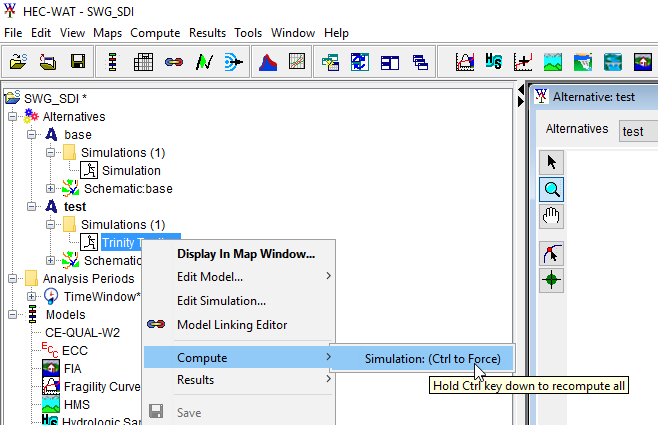</th>
</tr>
</thead>
<tbody>
<tr class="odd">
<td><em><strong>Figure 24. Compute Simulation</strong></em></td>
</tr>
</tbody>
</table>

  - This will bring up the simulation settings editor as shown in Figure
    25. Select **Next** and then select **Compute** as shown in Figure
    26.

<table>
<thead>
<tr class="header">
<th>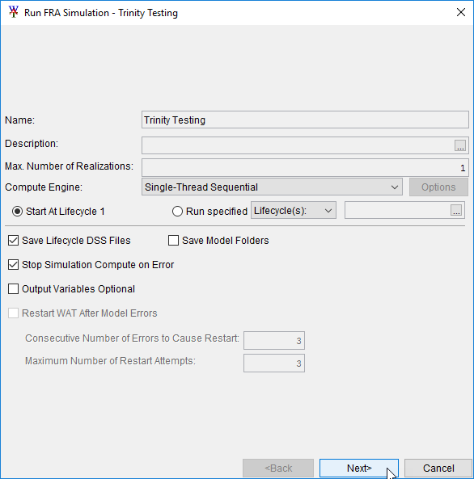</th>
</tr>
</thead>
<tbody>
<tr class="odd">
<td><em><strong>Figure 25. Run FRA Simulation</strong></em></td>
</tr>
</tbody>
</table>

<table>
<thead>
<tr class="header">
<th>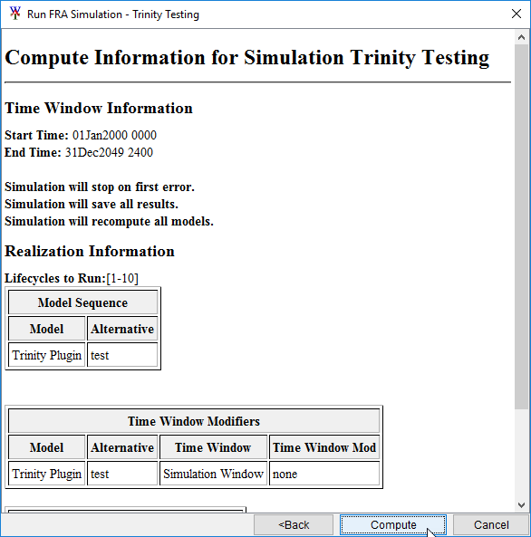</th>
</tr>
</thead>
<tbody>
<tr class="odd">
<td><em><strong>Figure 26. Compute Information for Simulation Editor</strong></em></td>
</tr>
</tbody>
</table>

10. Once the model completes you can access output by right clicking on
    the simulation, selecting **results**\>**Output
    Variables**\>**Frequency Viewer** as shown in Figure 27.

<table>
<thead>
<tr class="header">
<th></th>
</tr>
</thead>
<tbody>
<tr class="odd">
<td><em><strong>Figure 27. Results</strong></em></td>
</tr>
</tbody>
</table>
